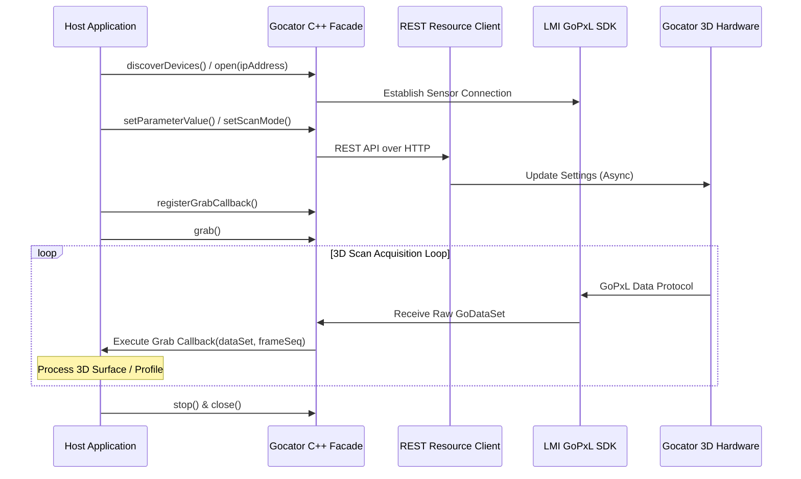

# 🔍 Gocator Module

[](https://en.cppreference.com/w/cpp/compiler_support)
[](#)
[](https://lmi3d.com/)

LMI Gocator 3D 센서의 라이프사이클 제어 및 GoPxL SDK 기반의 고성능 3D 프로파일/표면 데이터 수신을 처리하기 위한 Pure C++ 이미지 취득(Acquisition) 라이브러리 모듈입니다.

---

## 🚀 Key Features

* **Gocator Facade 수명주기 관리**: 센서 자동 검색(Discovery), 네트워크(IP) 기반 연결, 스캔 모드(Profile/Surface) 설정, Single/Continuous 데이터 Grabbing을 단일 C++ `Gocator` 클래스로 핸들링합니다.
* **GoPxL SDK 기반 고성능 3D 취득**: LMI 공식 GoPxL SDK(kApi / GoApi / GoPxLSdk)를 래핑하여 초고속 `GoDataSet` 3D 점군 및 2D 강도(Intensity) 데이터를 안전하게 수신합니다.
* **REST API 속성 제어 통합**: 센서 장치 내장 REST API에 접근해 센서 하드웨어 트래픽 부하 없이 노출 시간(Exposure), 레이저 파라미터, 스캔 영역 등의 원격 장치 설정을 비동기적으로 판독 및 변경합니다.
* **독립적 로깅 프레임워크**: `Gocator::syslog()`를 통해 외부 라이브러리(예: Playground의 `LogManager`)가 리다이렉트하여 수집할 수 있도록 표준 스트림 기반 로깅을 제공합니다.

---

## 📦 Data & Control Pipeline

센서 설정 제어(REST)와 고속 3D 데이터 취득(GoPxL SDK)의 이중화 통신 구조입니다.



---

## 🛠️ Requirements & Dependencies

| Requirement | Description |
| :--- | :--- |
| **OS Support** | Windows 10+ / Linux / macOS 12+ (Apple Silicon 및 x86_64 지원) |
| **C++ Standard** | C++17 이상 필수 (C++20 권장) |
| **LMI GoPxL SDK** | `modules/Gocator/GoPxL-SDK/` 하위에 각 타겟 OS용 GoPxL SDK (kApi, GoApi, GoPxLSdk) 포함 |

---

## 💻 Quick Start

### 1. CMake Integration
상위 프로젝트 CMakeLists.txt에 서브프로젝트 타겟으로 연결하여 빌드 체인에 추가합니다.

```cmake
# Qt 위젯 미사용 Pure C++ 전용 빌드 시 (선택)
set(GOCATOR_BUILD_QT_UI OFF CACHE BOOL "" FORCE)

# Add module target
add_subdirectory(modules/Gocator/C++)

# Link to host target
target_link_libraries(YourHostApp PRIVATE gocator_core)
```

> **Scene3D 어댑터 연동 (선택)**: 중립적 3D 시각화 레이어가 필요한 호스트 애플리케이션은 `GraphicsEngine` 타겟을 먼저 선언한 후 `GOCATOR_BUILD_GRAPHICSENGINE_ADAPTER=ON`을 설정하고 `Gocator::GraphicsEngineAdapter`를 명시적으로 링크합니다. Core 타겟인 `gocator_core`는 `GraphicsEngine`이나 VTK에 의존하지 않습니다.

### 2. Basic Example
```cpp
#include "Gocator.h"
#include <iostream>

int main()
{
    Gocator gocator;

    // 1. 센서 탐색
    auto devices = gocator.discoverDevices();
    if (devices.empty()) {
        std::cerr << "No Gocator sensor found." << std::endl;
        return 1;
    }

    // 2. 3D GoDataSet 수신 콜백 등록
    gocator.registerGrabCallback([](const GoPxLSdk::GoDataSet& dataSet, size_t frameSeq) {
        std::cout << "Acquired 3D Frame #" << frameSeq << std::endl;
        // GoDataSet 내부의 Surface / Profile 데이터 파싱 및 처리
    });

    // 3. 센서 연결 및 스캔 설정
    std::string ip = devices[0].address;
    if (!gocator.open(ip)) {
        std::cerr << "Failed to open Gocator sensor: " << ip << std::endl;
        return 1;
    }

    // Surface 스캔 모드 및 노출 시간(us) 설정
    gocator.setScanMode(Gocator::SurfaceMode);
    gocator.setExposureUs(10000);

    // 4. Grabbing 시작 (연속 수신)
    gocator.grab();

    // ... 비동기 취득 진행 ...

    // 5. 해제 시
    gocator.stop();
    gocator.close();

    return 0;
}
```

---

## ⚠️ Development Notes

> [!IMPORTANT]
> **표면 데이터(Surface) 렌더링 활성화**
> 데이터 취득 루프가 원활히 동작하고 있음에도 점군 데이터가 수신되지 않을 경우 물리 센서의 데이터 출력 설정을 확인해야 합니다.
> 1. 센서 웹 콘솔 또는 REST 파라미터 제어를 통해 **Surface Output** 설정을 활성화합니다.
> 2. 전달 대상 데이터 포맷이 `topRangeImage` 또는 `topIntensityImage` 등으로 정확히 선택되어 있는지 검증하십시오.

> [!WARNING]
> **프레임 단위 로그 방지**
> 실시간 3D 데이터 취득 시 초당 전송되는 점군 페이로드가 매우 큽니다. Grab 콜백 내부에서 콘솔 출력(`std::cout`)이나 무분별한 동기식 I/O를 수행할 경우 스레드 동기화 병목 및 프레임 드롭이 발생할 수 있습니다.

> [!NOTE]
> **호스트 로그 전달 계약 (`syslog`)**
> `Gocator::syslog()`는 단일 `[Gocator]` 레코드를 `std::cout` 또는 `std::cerr`로 즉시 플러시하여 출력합니다. Playground의 `LogManager`와 같은 호스트 로그 수집기는 버퍼링 대기 없이 라이프사이클 및 오퍼레이션 피드백을 수집할 수 있습니다.

> [!CAUTION]
> **자원 해제 수명주기**
> 애플리케이션 종료 시 `Gocator` 객체가 소멸하기 전에 `gocator.stop()`, `gocator.close()`를 순차적으로 호출하여 GoPxL SDK 스캔 작업과 소켓 연결을 안전하게 해제해야 합니다.
