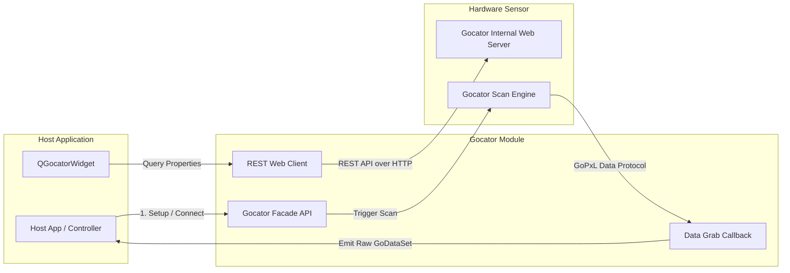

# 🔍 Gocator Module

[](https://en.cppreference.com/w/cpp/compiler_support)
[](#)
[](https://lmi3d.com/)
[](https://www.qt.io/)

LMI Gocator 3D 센서의 라이프사이클 제어 및 GoPxL SDK 기반의 고성능 3D 프로파일/표면 데이터 취득을 처리하기 위한 C++ 핵심 라이브러리 모듈입니다.

---

## 🚀 Key Features

* **Gocator Facade 제어**: 센서 검색(Discovery), 가상/실제 연결 수명주기 관리, Single/Continuous 데이터 Grabbing 및 장치 설정 관리 API를 단일 Facade 인터페이스로 단축 제공합니다.
* **REST API 속성 제어**: 센서 장치 내장 REST API에 접근해 센서 하드웨어 트래픽 부하 없이 노출값, 레이저 파라미터 등의 원격 장치 설정을 비동기적으로 판독 및 변경합니다.
* **Qt6 모니터링 컨트롤**: 실시간 장치 정보 모니터링, 데이터 취득 상태 표시등 및 원격 파라미터 트리 파싱 뷰를 내장한 전용 위젯 `QGocatorWidget`을 제공합니다.
* **표준 로깅 지원**: `Gocator::syslog()`를 통해 외부 라이브러리(예: Playground의 `LogManager`)가 리다이렉트하여 수집할 수 있도록 표준 스트림 형태의 로깅 파이프라인을 구축해 둡니다.

---

## 📦 Data & Control Pipeline

센서 설정 제어(REST)와 초고속 3D 데이터 취득(GoPxL SDK)의 이중화된 통신 파이프라인 구조입니다.



---

## 🛠️ Requirements & Dependencies

| Requirement | Description |
| :--- | :--- |
| **OS Support** | macOS 12+ / Windows 10+ |
| **C++ Standard** | C++17 이상 필수 |
| **LMI GoPxL SDK** | `modules/Gocator/GoPxL-SDK/` 하위에 해당 타겟 OS용 GoPxL SDK 구성이 선행되어야 함 |
| **Qt Framework** | Qt 6.x (Core, Gui, Widgets) *[선택 사항, UI 위젯 활성 시]* |

---

## 💻 Quick Start

### 1. CMake Integration
상위 프로젝트 CMakeLists.txt에 서브프로젝트 타겟으로 연결하여 빌드 체인에 추가합니다.

```cmake
# Add module target
add_subdirectory(modules/Gocator)

# Link to host target
target_link_libraries(YourHostApp PRIVATE Gocator)
```

### 2. Basic Example
```cpp
#include "Gocator.h"
#include <memory>
#include <iostream>

int main()
{
    auto gocator = std::make_unique<Gocator>();

    // 3D GoDataSet 수신 콜백 등록
    gocator->registerGrabCallback([](const GoPxLSdk::GoDataSet& dataSet, size_t frameNo) {
        std::cout << "3D Data Frame Received: " << frameNo << std::endl;
        
        // GoDataSet 내 Surface / Profile 데이터 파싱 처리
    });

    // 센서 연결 및 스캔 기동
    if (gocator->connect("192.168.1.10")) {
        gocator->grab();
    }
}
```

---

## ⚠️ Development Notes

> [!IMPORTANT]
> **표면 데이터(Surface) 렌더링 활성화 팁**
> 데이터 취득 루프가 원활히 돌고 있음에도 시각화 영역에 아무런 데이터가 노출되지 않을 경우, 물리 센서의 출력 데이터 포맷을 점검해야 합니다.
> 1. `List Sources`를 통해 장치가 3D 표면 전송을 활성화하고 있는지 조회합니다.
> 2. 센서 웹 콘솔 또는 REST 속성 제어로 **Surface Output** 설정을 활성화합니다.
> 3. 전달 대상 데이터 유형이 `topIntensityImage` 또는 `topRangeImage` 등으로 정확히 선택되어 있는지 검증하십시오.

> [!WARNING]
> **프레임 단위 디버그 로그 지양**
> 실시간 3D 취득은 대역폭 소모가 극심합니다. 매 프레임마다 Grab 콜백 내에서 `std::cout` 로그를 무분별하게 유발할 경우 스레드 동기화 락으로 인한 성능 저하 및 패킷 드랍이 발생합니다. 프레임 갱신 주기는 별도 통계 스레드에서 정주기 출력하는 구조로 가져가야 합니다.

> [!TIP]
> **Unified status-bar style contract**
> When implementing or extending UI, keep the geometry of the `Idle` / `Disconnected` / `Connected` / `Live` status indicator bubble aligned with the Camera module's `QCameraWidget`. The shared dynamic CSS property (`status`) should stay compatible with the Resources module style map.
